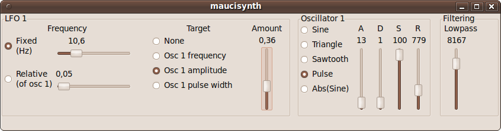
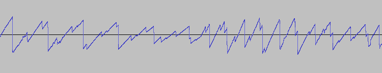
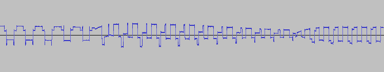

# maucisynth

Minimal subtractive software synthesizer

## Overview

Graphical user interface of the synthesizer made with GTK2.

Time-amplitude view of polyphonic sawtooth waveform with exponential
ADSR curve.

Time-amplitude view of square wave signal with pulse width modulation.

- A simple software synthesizer, can be played in realtime by the computer keyboard
- A hobby project, C programming language, 2160 lines
- Additive synthesis similar to Moog synthesizers
- Polyphonic, monotimbral
- Exponential Attack-Decay-Sustain-Release amplitude envelope curve
- Amplitude, frequency and pulse width modulation
- Simple lowpass filter
- User interface built on GTK+, sound API JACK (http://jackaudio.org/)
- Realtime, multithreaded

## Sound samples

https://github.com/user-attachments/assets/7fd0ac55-3e76-4b03-86ae-ab9e8b6559fd

