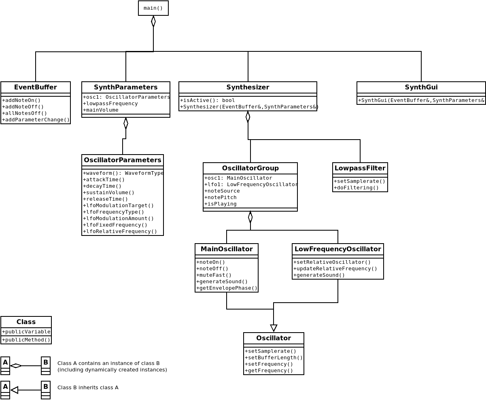

# Architecture

The class diagram above is made with [Dia 0.98](https://wiki.gnome.org/Apps/Dia/).

`main()` creates an `EventBuffer`, a `SynthParameters`, a `Synthesizer`, and
a `SynthGui`. It passes the `EventBuffer` and `SynthParameters` as a reference to
both the instance of a `Synthesizer` and `SynthGui`.

